# Copilot Orchestrator

A universal meta-skill that transforms any development request into orchestrated
GitHub Copilot SDK calls. Instead of maintaining dozens of specialized skills,
this orchestrator interprets your intent, manages context efficiently, and
delegates execution to the appropriate SDK configuration.

```mermaid
flowchart LR
    subgraph orchestrator["COPILOT ORCHESTRATOR"]
        A["📝 REQUEST<br/>(any task)"] --> B["📦 CONTEXT MANAGER<br/>• Compression<br/>• Token budget<br/>• State mgmt"]
        B --> C["🤖 COPILOT SDK SESSION<br/>• Streaming responses<br/>• Dynamic tools<br/>• MCP integration"]
        
        B --> D["🔧 TOOL FACTORY<br/>• File ops<br/>• Code analysis<br/>• Web fetch<br/>• Testing"]
        
        C --> E["📁 ARTIFACTS<br/>• Generated code<br/>• Documentation<br/>• Test suites<br/>• Deployment configs"]
    end
```



## When to Use This Skill

This skill activates automatically when you need to:

| Intent Category | Example Prompts |
|-----------------|-----------------|
| **Implement** | "build a REST API", "create a login form", "add caching layer" |
| **Analyze** | "review this code", "find security issues", "audit dependencies" |
| **Generate** | "write documentation", "create README", "generate API specs" |
| **Refactor** | "restructure this module", "apply SOLID principles", "extract service" |
| **Debug** | "fix this error", "why is this failing", "diagnose performance issue" |
| **Test** | "write unit tests", "add integration tests", "improve coverage" |
| **Deploy** | "create CI/CD pipeline", "dockerize this app", "setup Kubernetes" |
| **Automate** | "create GitHub Action", "automate releases", "schedule backups" |
| **Scaffold** | "bootstrap React app", "initialize Python project", "create monorepo" |
| **Migrate** | "convert to TypeScript", "upgrade framework", "modernize codebase" |
| **Optimize** | "improve performance", "reduce bundle size", "optimize queries" |

## Prerequisites

1. **Python 3.11+** installed and available in PATH
2. **uv** package manager ([installation](https://docs.astral.sh/uv/getting-started/installation/))
3. **GitHub Copilot CLI** authenticated (`copilot --version`)

## How It Works

### Step 1: Task Classification

When you make a request, the orchestrator classifies it into a capability type:

```python
# The orchestrator maps your intent to an SDK configuration
task_type = classify_task("implement user authentication with OAuth2")
# → TaskType.IMPLEMENT with features: ["oauth2", "authentication", "security"]
```

### Step 2: Context Compression

Large contexts are semantically compressed to fit within token budgets:

```python
# Before: 50,000 tokens of codebase context
# After: 8,000 tokens of relevant, compressed context
compressed = context_manager.compress(
    context=workspace_context,
    task_type=task_type,
    budget=TokenBudget(input=8000, output=4000)
)
```

### Step 3: Dynamic Tool Assembly

Tools are assembled based on what the task requires:

```python
# For "implement feature" tasks, these tools are auto-registered:
tools = tool_factory.for_task(
    task_type=TaskType.IMPLEMENT,
    features=["file_write", "code_analysis", "test_runner"]
)
```

### Step 4: SDK Session Execution

The orchestrator creates a Copilot SDK session with optimal configuration:

```python
session = await client.create_session({
    "model": select_model(task_type),  # gpt-4.1 for code, claude-sonnet-4.5 for reasoning
    "streaming": True,
    "tools": tools,
    "system_message": generate_system_prompt(task_type, compressed.metadata)
})

response = await session.send_and_wait({
    "prompt": build_prompt(original_request, compressed.context)
})
```

### Step 5: Artifact Collection

Generated artifacts (code, docs, configs) are collected and presented:

```python
artifacts = collect_artifacts(response)
# → [CodeFile("src/auth.py"), TestFile("tests/test_auth.py"), Doc("AUTH.md")]
```

## Execution

Run the orchestrator directly:

```bash
# Install dependencies (first time only)
cd .github/skills/copilot-orchestrator/scripts
uv sync

# Execute with a task
uv run python orchestrator.py "implement a REST endpoint for user registration"

# With explicit context file
uv run python orchestrator.py --context ./src/models.py "add validation to User model"

# Debug mode with verbose logging
uv run python orchestrator.py --debug "why is my test failing"
```

## Configuration

The orchestrator respects environment variables:

| Variable | Default | Description |
|----------|---------|-------------|
| `COPILOT_MODEL` | `gpt-4.1` | Default model for SDK sessions |
| `COPILOT_TOKEN_BUDGET` | `8000` | Max input tokens per session |
| `COPILOT_STREAMING` | `true` | Enable streaming responses |
| `COPILOT_DEBUG` | `false` | Enable debug logging |

## Context Transfer Protocol

The orchestrator uses a structured context envelope for SDK communication:

```json
{
  "task_id": "550e8400-e29b-41d4-a716-446655440000",
  "task_type": "implement",
  "compressed_context": "...",
  "token_budget": {"input": 8000, "output": 4000},
  "artifacts": ["src/models.py", "src/routes.py"],
  "restoration_point": {"session_id": "...", "turn": 3}
}
```

See [references/CONTEXT_PROTOCOL.md](references/CONTEXT_PROTOCOL.md) for full specification.

## Extending the Orchestrator

### Adding Custom Tools

Create a new tool in `scripts/custom_tools/`:

```python
from tool_factory import register_tool, ToolSchema

@register_tool(
    name="my_custom_tool",
    description="Does something specialized",
    task_types=[TaskType.IMPLEMENT, TaskType.AUTOMATE]
)
async def my_custom_tool(params: MyParams) -> dict:
    """
    Custom tool implementation.
    
    Args:
        params: Validated parameters from Pydantic model
        
    Returns:
        Result dictionary to send back to SDK
    """
    # Your implementation here
    return {"result": "success", "data": ...}
```

### Adding Capability Mappings

Edit [references/CAPABILITY_REGISTRY.md](references/CAPABILITY_REGISTRY.md) to map new
intents to SDK configurations.

## Troubleshooting

| Issue | Solution |
|-------|----------|
| "Copilot CLI not found" | Install CLI: `gh extension install github/gh-copilot` |
| "Authentication failed" | Run `copilot auth login` |
| "Token budget exceeded" | Reduce context with `--max-context 4000` |
| "Tool execution failed" | Check tool logs in `.github/skills/copilot-orchestrator/logs/` |
| "Session timeout" | Increase timeout with `--timeout 120` |

## References

- [Context Protocol Specification](references/CONTEXT_PROTOCOL.md)
- [Tool Patterns Library](references/TOOL_PATTERNS.md)
- [Capability Registry](references/CAPABILITY_REGISTRY.md)
- [Ephemeral Skill Template](templates/ephemeral_skill.md)

## Architecture

```
scripts/
├── orchestrator.py      # Main entry point and SDK bridge
├── context_manager.py   # Semantic compression and token budgeting
├── tool_factory.py      # Dynamic tool schema generation
├── models.py            # Pydantic models for type safety
└── tests/               # Unit and integration tests
```

The orchestrator is designed for transparency - all code is heavily commented
to enable understanding, debugging, and extension.
