# SkillPilot — One skill to rule them all.

> A universal meta-skill that orchestrates GitHub Copilot SDK to perform any development task.

[](https://docs.github.com/en/copilot)
[](https://www.python.org/downloads/)
[](LICENSE)

## What is SkillPilot?

SkillPilot is a **"skill factory"** for GitHub Copilot. When you use a repository created from this template, the meta-skill intercepts your requests to Copilot and dynamically handles them by:

1. **Spawning ephemeral skills** for simple operations (list files, run commands)
2. **Using the Copilot SDK** for complex tasks (implement features, refactor code)

```mermaid
flowchart LR
    subgraph input["You Ask Copilot"]
        A1["list files here"]
        A2["run the tests"]
        A3["implement OAuth login"]
        A4["refactor to microservices"]
        A5["debug this error"]
    end
    
    subgraph output["SkillPilot Handles It"]
        B1["Shell skill → ls/dir"]
        B2["Test runner → pytest/jest"]
        B3["SDK session → generates code"]
        B4["SDK session → restructures app"]
        B5["SDK session → diagnoses & fixes"]
    end
    
    A1 --> B1
    A2 --> B2
    A3 --> B3
    A4 --> B4
    A5 --> B5
```



## The Flow

When you ask Copilot something in a repository using SkillPilot:

```mermaid
flowchart TD
    A["🗣️ You ask Copilot"] --> B["🤖 Copilot<br/>(VS Code)"]
    B --> C{"SKILL.md<br/>matches request"}
    C --> D["🎯 Orchestrator<br/>decides how"]
    
    D --> E["⚡ Ephemeral Skill<br/>(shell, files)"]
    D --> F["🔧 SDK Session<br/>(complex tasks)"]
    D --> G["📦 Delegate<br/>(existing skill)"]
    
    E --> H["✅ Result<br/>returned to you"]
    F --> H
    G --> H
```



## Quick Start

### 1. Use as Template

Click **"Use this template"** → **"Create a new repository"**

### 2. Clone Your New Repository

```bash
git clone https://github.com/YOUR_USERNAME/your-repo-name.git
cd your-repo-name
```

### 3. Install Dependencies

```bash
cd .github/skills/copilot-orchestrator/scripts
uv sync
```

### 4. Use Copilot Normally

Now when you ask Copilot questions in VS Code, the meta-skill will handle them:

```
You: "list all Python files"
Copilot: [uses skill] → shows all .py files

You: "implement a REST API for user registration"  
Copilot: [uses skill] → generates full implementation
```

## Example Interactions

### Simple Operations (Ephemeral Skills)

These spawn lightweight, specialized skills:

| You Ask | Skill Spawned | Action |
|---------|---------------|--------|
| "list files in src/" | shell-executor | Runs `ls` or `Get-ChildItem` |
| "find all TODO comments" | shell-executor | Runs `grep -r TODO` |
| "run the tests" | test-runner | Executes pytest/jest |
| "show me package.json" | file-operations | Reads and displays file |
| "what's my git status" | shell-executor | Runs `git status` |

### Complex Operations (SDK Sessions)

These use full Copilot SDK sessions with context gathering, tool execution, and multi-step reasoning:

| You Ask | Task Type | What Happens |
|---------|-----------|--------------|
| "implement user authentication" | IMPLEMENT | Generates auth code, tests, docs |
| "review this code for issues" | ANALYZE | Deep analysis with recommendations |
| "refactor UserService" | REFACTOR | Restructures with best practices |
| "why is this test failing" | DEBUG | Diagnoses, explains, and fixes |
| "add integration tests" | TEST | Creates comprehensive test suite |

#### Example: Implementing a Feature

```
You: "implement a REST API endpoint for user registration with email validation"

SkillPilot:
┌─────────────────────────────────────────────────────────────────┐
│ 🎯 Task: IMPLEMENT                                              │
│ 📊 Confidence: 95%                                              │
│ 🔧 Tools: read_file, write_file, search_code, run_command       │
└─────────────────────────────────────────────────────────────────┘

1. Gathering context...
   ✓ Found existing routes in src/routes/
   ✓ Found User model in src/models/user.py
   ✓ Found validation patterns in src/utils/validators.py

2. Creating implementation plan...
   • Add POST /api/users/register endpoint
   • Create email validation utility
   • Add request/response schemas
   • Write unit tests

3. Generating code...

   Created: src/routes/auth.py
   ─────────────────────────────
   from fastapi import APIRouter, HTTPException
   from pydantic import BaseModel, EmailStr
   from src.models.user import User
   from src.utils.validators import validate_email
   
   router = APIRouter(prefix="/api/users")
   
   class RegisterRequest(BaseModel):
       email: EmailStr
       password: str
       name: str
   
   @router.post("/register")
   async def register_user(request: RegisterRequest):
       if not validate_email(request.email):
           raise HTTPException(400, "Invalid email format")
       # ... implementation continues

   Created: tests/test_auth.py
   ─────────────────────────────
   # Unit tests for registration endpoint...

✅ Implementation complete. Created 2 files, modified 1 file.
```

#### Example: Debugging an Issue

```
You: "why is my test test_user_creation failing with AttributeError?"

SkillPilot:
┌─────────────────────────────────────────────────────────────────┐
│ 🎯 Task: DEBUG                                                  │
│ 📊 Confidence: 92%                                              │
│ 🔧 Tools: read_file, search_code, run_command, analyze_code     │
└─────────────────────────────────────────────────────────────────┘

1. Running failing test to capture error...
   $ pytest tests/test_user.py::test_user_creation -v
   
   AttributeError: 'User' object has no attribute 'full_name'
   at tests/test_user.py:15

2. Analyzing the error...
   ✓ Reading tests/test_user.py (line 15)
   ✓ Reading src/models/user.py
   ✓ Checking recent changes with git diff

3. Root cause identified:
   
   The User model was refactored to use 'name' instead of 'full_name',
   but the test still references the old attribute.
   
   Commit abc123 (2 hours ago) renamed:
   - self.full_name → self.name

4. Suggested fix:

   tests/test_user.py (line 15)
   ─────────────────────────────
   - assert user.full_name == "John Doe"
   + assert user.name == "John Doe"

   Apply this fix? [Yes/No]
```

#### Example: Refactoring Code

```
You: "refactor the PaymentService to use the strategy pattern for different payment providers"

SkillPilot:
┌─────────────────────────────────────────────────────────────────┐
│ 🎯 Task: REFACTOR                                               │
│ 📊 Confidence: 88%                                              │
│ 🔧 Tools: read_file, write_file, search_code, analyze_code      │
└─────────────────────────────────────────────────────────────────┘

1. Analyzing current implementation...
   ✓ Found PaymentService in src/services/payment.py
   ✓ Found 3 payment providers: Stripe, PayPal, Square
   ✓ Current approach: if/elif chain (47 lines)
   ✓ Found 12 files that import PaymentService

2. Refactoring plan:
   
   Current structure:
   └── src/services/payment.py (monolithic)
   
   Proposed structure:
   └── src/services/payment/
       ├── __init__.py
       ├── base.py           # Abstract PaymentStrategy
       ├── stripe.py         # StripePaymentStrategy
       ├── paypal.py         # PayPalPaymentStrategy
       ├── square.py         # SquarePaymentStrategy
       └── service.py        # PaymentService (uses strategies)

3. Benefits:
   • Adding new providers requires only a new strategy file
   • Each provider's logic is isolated and testable
   • Open/Closed principle: open for extension, closed for modification

4. Generating refactored code...
   
   Created: src/services/payment/base.py
   ─────────────────────────────────────
   from abc import ABC, abstractmethod
   
   class PaymentStrategy(ABC):
       @abstractmethod
       async def charge(self, amount: float, token: str) -> dict:
           pass
       
       @abstractmethod
       async def refund(self, transaction_id: str) -> dict:
           pass

   [... continues with full implementation ...]

5. Updating imports in dependent files...
   ✓ Updated src/routes/checkout.py
   ✓ Updated src/routes/subscriptions.py
   ✓ Updated tests/test_payment.py

✅ Refactoring complete. 
   Created: 6 files
   Modified: 4 files  
   Deleted: 1 file (old monolithic service)
   
   Run tests to verify: pytest tests/test_payment.py -v
```

#### Example: Code Analysis

```
You: "analyze the authentication module for security vulnerabilities"

SkillPilot:
┌─────────────────────────────────────────────────────────────────┐
│ 🎯 Task: ANALYZE                                                │
│ 📊 Confidence: 90%                                              │
│ 🔧 Tools: read_file, search_code, analyze_code                  │
└─────────────────────────────────────────────────────────────────┘

1. Scanning authentication module...
   ✓ src/auth/login.py
   ✓ src/auth/tokens.py
   ✓ src/auth/middleware.py
   ✓ src/auth/password.py

2. Security Analysis Results:

   🔴 CRITICAL (1 issue)
   ─────────────────────
   src/auth/password.py:23
   Password hashing uses MD5 - cryptographically broken
   
   Current:  hashlib.md5(password.encode()).hexdigest()
   Fix:      Use bcrypt or argon2 instead
   
   🟡 WARNING (2 issues)
   ─────────────────────
   src/auth/tokens.py:45
   JWT secret loaded from code, not environment variable
   Risk: Secret could be committed to version control
   
   src/auth/login.py:67
   No rate limiting on login attempts
   Risk: Vulnerable to brute force attacks
   
   🟢 GOOD PRACTICES FOUND
   ───────────────────────
   ✓ HTTPS enforced in middleware
   ✓ Secure cookie flags set correctly
   ✓ CSRF protection enabled

3. Recommendations:
   
   Priority 1: Replace MD5 with bcrypt
   Priority 2: Move JWT secret to environment variable
   Priority 3: Add rate limiting (suggest: slowapi or redis-based)
   
   Would you like me to implement any of these fixes?
```

## Ephemeral Skills

The orchestrator can spawn these specialized skills on-demand:

### Shell Executor
Runs bash/PowerShell commands based on natural language:
- "list files" → `ls -la` / `Get-ChildItem`
- "find Python files" → `find . -name '*.py'` / `Get-ChildItem -Filter *.py`
- "git status" → `git status`

### File Operations
Direct file manipulation:
- Read file contents
- List directory contents
- Search within files

### Test Runner
Execute test suites:
- Auto-detects pytest, jest, unittest
- Collects and reports results

### Code Runner
Execute code snippets:
- Python execution
- JavaScript execution

## Persisting Ephemeral Skills

If you find yourself using a certain ephemeral skill pattern repeatedly, you can persist it as a permanent skill:

```python
from orchestrator import EphemeralSkillSpawner

spawner = EphemeralSkillSpawner(workspace=Path.cwd())
# After using an ephemeral skill...
spawner.persist_skill("shell", "my-shell-commands")
# Creates .github/skills/my-shell-commands/SKILL.md
```

## Project Structure

```
your-repo/
├── .github/
│   └── skills/
│       └── copilot-orchestrator/
│           ├── SKILL.md              # Triggers when Copilot sees your request
│           ├── scripts/
│           │   ├── orchestrator.py   # Main handler (decides SDK vs ephemeral)
│           │   ├── context_manager.py # Token budgeting & compression
│           │   ├── tool_factory.py   # Dynamic tool assembly
│           │   ├── models.py         # Pydantic data models
│           │   └── pyproject.toml    # Dependencies (uv)
│           ├── references/           # Orchestrator documentation
│           └── templates/            # Ephemeral skill templates
├── README.md
└── LICENSE
```

## How It Works (Detailed)

### Step 1: SKILL.md Matching
When you ask Copilot something, it checks if any SKILL.md files match your intent. The `copilot-orchestrator` skill has a broad description that matches most development tasks.

### Step 2: Orchestrator Receives Request
The orchestrator receives your natural language request and decides the best execution path.

### Step 3: Execution Path Selection

**Fast Path (Ephemeral Skills):**
- Triggered by keywords like "list", "run", "execute", "git", "test"
- Spawns a lightweight, specialized skill
- Returns results immediately

**Full Path (SDK Session):**
- Triggered by complex tasks: implement, refactor, debug, analyze
- Creates a Copilot SDK session with appropriate tools
- Manages context compression and token budgeting
- Streams results with rich formatting

### Step 4: Results Returned
Whether via ephemeral skill or SDK session, results are returned to you through Copilot's interface.

## Prerequisites

- **Python 3.11+** — [Download](https://www.python.org/downloads/)
- **uv** — [Installation Guide](https://docs.astral.sh/uv/getting-started/installation/)
- **GitHub Copilot** — Active subscription with VS Code extension

## Configuration

Set environment variables to customize behavior:

```bash
export COPILOT_MODEL=gpt-4.1          # Model selection
export COPILOT_TOKEN_BUDGET=8000      # Max input tokens
export COPILOT_STREAMING=true         # Enable streaming
export COPILOT_DEBUG=false            # Debug logging
```

## Using as a GitHub Template

This repository is configured as a **GitHub Template**. To use it:

1. Click **"Use this template"** → **"Create a new repository"**
2. Name your repository and set visibility
3. Clone your new repository
4. Customize the skill for your needs

### What Gets Copied

- ✅ All source files and skill definitions
- ✅ Directory structure
- ✅ Configuration files
- ❌ Git history (starts fresh)
- ❌ Stars, watchers, forks counts

## Extending SkillPilot

### Add Custom Tools

Create tools in `scripts/custom_tools/`:

```python
from tool_factory import register_tool, TaskType

@register_tool(
    name="my_tool",
    description="Does something useful",
    task_types=[TaskType.IMPLEMENT]
)
async def my_tool(params: MyParams) -> dict:
    # Implementation
    return {"result": "success"}
```

### Add Capability Mappings

Edit `references/CAPABILITY_REGISTRY.md` to map new intents to SDK configurations.

## Contributing

Contributions are welcome! Please read our contributing guidelines before submitting PRs.

1. Fork the repository
2. Create a feature branch (`git checkout -b feature/amazing-feature`)
3. Commit changes (`git commit -m 'Add amazing feature'`)
4. Push to branch (`git push origin feature/amazing-feature`)
5. Open a Pull Request

## License

This project is licensed under the MIT License - see the [LICENSE](LICENSE) file for details.

## Acknowledgments

- [GitHub Copilot SDK](https://docs.github.com/en/copilot) for the AI foundation
- [Agent Skills](https://agentskills.io/) for the skill file format specification
- [uv](https://docs.astral.sh/uv/) for blazing fast Python package management

---

<p align="center">
  <strong>SkillPilot</strong> — One skill to rule them all.
</p>
