<p align="center">
  
</p>

# SkillPilot — One skill to rule them all.

> A universal meta-skill that orchestrates GitHub Copilot SDK to perform any development task.

[](https://docs.github.com/en/copilot)
[](https://www.python.org/downloads/)
[](LICENSE)

## What is SkillPilot?

SkillPilot is the **"Mother of All Skills"** for GitHub Copilot. When you use a repository with this skill, it transforms **any** development request into expert-level action by:

1. **Template matching** — Checks 30+ built-in templates from awesome-copilot patterns
2. **SDK sessions** — Uses GitHub Copilot SDK for complex tasks with expert-level guidance
3. **Native tools** — Simple operations (list files, run commands) use Copilot's built-in tools

```mermaid
flowchart LR
    subgraph input["You Ask Copilot"]
        A1["list files here"]
        A2["run the tests"]
        A3["implement OAuth login"]
        A4["refactor to microservices"]
        A5["debug this error"]
    end
    
    subgraph output["SkillPilot Handles It"]
        B1["Native tool → run_in_terminal"]
        B2["Native tool → runTests"]
        B3["Template + SDK → REST API pattern"]
        B4["SDK session → restructures app"]
        B5["Template + SDK → debug pattern"]
    end
    
    A1 --> B1
    A2 --> B2
    A3 --> B3
    A4 --> B4
    A5 --> B5
```



## The Flow

When you ask Copilot something in a repository using SkillPilot:

```mermaid
flowchart TD
    A["🗣️ You ask Copilot"] --> B["🤖 Copilot<br/>(VS Code)"]
    B --> C{"SKILL.md<br/>matches request"}
    C --> D["🎯 Orchestrator<br/>classifies intent"]
    
    D --> E["📋 Template Match<br/>(30+ patterns)"]
    D --> F["🔧 SDK Session<br/>(expert guidance)"]
    D --> G["🛠️ Native Tools<br/>(simple operations)"]
    
    E --> H["✅ Result<br/>returned to you"]
    F --> H
    G --> H
```



## Quick Start

### Option A: From Template (New Projects)

1. Click **"Use this template"** → **"Create a new repository"**
2. Clone your new repository:
   ```bash
   git clone https://github.com/YOUR_USERNAME/your-repo-name.git
   cd your-repo-name
   ```
3. Install dependencies:
   ```bash
   cd .github/skills/copilot-orchestrator/scripts
   uv sync
   ```

### Option B: As Submodule (Existing Projects)

1. Add the skill directly to your existing repo:
   ```bash
   # Add submodule with sparse checkout to only get the skill
   git submodule add --no-checkout https://github.com/samueltauil/skillpilot.git .github/skills/copilot-orchestrator
   cd .github/skills/copilot-orchestrator
   git sparse-checkout init --cone
   git sparse-checkout set .github/skills/copilot-orchestrator
   git checkout main
   
   # Move contents up and clean nested structure
   mv .github/skills/copilot-orchestrator/* .
   rm -rf .github LICENSE README.md logo.svg 2>/dev/null
   ```
2. Install dependencies:
   ```bash
   cd scripts
   uv sync
   ```
3. Commit the changes:
   ```bash
   cd ../../../..
   git add .gitmodules .github/skills/copilot-orchestrator
   git commit -m "Add copilot-orchestrator skill as submodule"
   ```

> **Note**: The folder name `copilot-orchestrator` must match the `name` field in [SKILL.md](SKILL.md) front-matter for Copilot to discover the skill correctly.

### Using Copilot

Now when you ask Copilot questions in VS Code, the meta-skill will handle them:

```
You: "list all Python files"
Copilot: [uses skill] → shows all .py files

You: "implement a REST API for user registration"  
Copilot: [uses skill] → generates full implementation
```

## Example Interactions

### Simple Operations (Native Tools)

These use Copilot's built-in tools directly — no extra abstraction layer:

| You Ask | Native Tool | Action |
|---------|-------------|--------|
| "list files in src/" | `run_in_terminal` | Runs `ls` or `Get-ChildItem` |
| "find all TODO comments" | `grep_search` | Searches for pattern in files |
| "run the tests" | `runTests` | Executes pytest/jest |
| "show me package.json" | `read_file` | Reads and displays file |
| "what's my git status" | `run_in_terminal` | Runs `git status` |

### Complex Operations (SDK Sessions)

These use full Copilot SDK sessions with context gathering, tool execution, and multi-step reasoning:

| You Ask | Task Type | What Happens |
|---------|-----------|--------------|
| "implement user authentication" | IMPLEMENT | Generates auth code, tests, docs |
| "review this code for issues" | ANALYZE | Deep analysis with recommendations |
| "refactor UserService" | REFACTOR | Restructures with best practices |
| "why is this test failing" | DEBUG | Diagnoses, explains, and fixes |
| "add integration tests" | TEST | Creates comprehensive test suite |

#### Example: Implementing a Feature

```
You: "implement a REST API endpoint for user registration with email validation"

SkillPilot:
┌───────────────────────────────────────────────────────────────┐
│  Task: IMPLEMENT                                              │
│  Confidence: 95%                                              │
│  Tools: read_file, write_file, search_code, run_command       │
└───────────────────────────────────────────────────────────────┘

1. Gathering context...
   ✓ Found existing routes in src/routes/
   ✓ Found User model in src/models/user.py
   ✓ Found validation patterns in src/utils/validators.py

2. Creating implementation plan...
   • Add POST /api/users/register endpoint
   • Create email validation utility
   • Add request/response schemas
   • Write unit tests

3. Generating code...

   Created: src/routes/auth.py
   ─────────────────────────────
   from fastapi import APIRouter, HTTPException
   from pydantic import BaseModel, EmailStr
   from src.models.user import User
   from src.utils.validators import validate_email
   
   router = APIRouter(prefix="/api/users")
   
   class RegisterRequest(BaseModel):
       email: EmailStr
       password: str
       name: str
   
   @router.post("/register")
   async def register_user(request: RegisterRequest):
       if not validate_email(request.email):
           raise HTTPException(400, "Invalid email format")
       # ... implementation continues

   Created: tests/test_auth.py
   ─────────────────────────────
   # Unit tests for registration endpoint...

✅ Implementation complete. Created 2 files, modified 1 file.
```

#### Example: Debugging an Issue

```
You: "why is my test test_user_creation failing with AttributeError?"

SkillPilot:
┌───────────────────────────────────────────────────────────────┐
│  Task: DEBUG                                                  │
│  Confidence: 92%                                              │
│  Tools: read_file, search_code, run_command, analyze_code     │
└───────────────────────────────────────────────────────────────┘

1. Running failing test to capture error...
   $ pytest tests/test_user.py::test_user_creation -v
   
   AttributeError: 'User' object has no attribute 'full_name'
   at tests/test_user.py:15

2. Analyzing the error...
   ✓ Reading tests/test_user.py (line 15)
   ✓ Reading src/models/user.py
   ✓ Checking recent changes with git diff

3. Root cause identified:
   
   The User model was refactored to use 'name' instead of 'full_name',
   but the test still references the old attribute.
   
   Commit abc123 (2 hours ago) renamed:
   - self.full_name → self.name

4. Suggested fix:

   tests/test_user.py (line 15)
   ─────────────────────────────
   - assert user.full_name == "John Doe"
   + assert user.name == "John Doe"

   Apply this fix? [Yes/No]
```

#### Example: Refactoring Code

```
You: "refactor the PaymentService to use the strategy pattern for different payment providers"

SkillPilot:
┌───────────────────────────────────────────────────────────────┐
│  Task: REFACTOR                                               │
│  Confidence: 88%                                              │
│  Tools: read_file, write_file, search_code, analyze_code      │
└───────────────────────────────────────────────────────────────┘

1. Analyzing current implementation...
   ✓ Found PaymentService in src/services/payment.py
   ✓ Found 3 payment providers: Stripe, PayPal, Square
   ✓ Current approach: if/elif chain (47 lines)
   ✓ Found 12 files that import PaymentService

2. Refactoring plan:
   
   Current structure:
   └── src/services/payment.py (monolithic)
   
   Proposed structure:
   └── src/services/payment/
       ├── __init__.py
       ├── base.py           # Abstract PaymentStrategy
       ├── stripe.py         # StripePaymentStrategy
       ├── paypal.py         # PayPalPaymentStrategy
       ├── square.py         # SquarePaymentStrategy
       └── service.py        # PaymentService (uses strategies)

3. Benefits:
   • Adding new providers requires only a new strategy file
   • Each provider's logic is isolated and testable
   • Open/Closed principle: open for extension, closed for modification

4. Generating refactored code...
   
   Created: src/services/payment/base.py
   ─────────────────────────────────────
   from abc import ABC, abstractmethod
   
   class PaymentStrategy(ABC):
       @abstractmethod
       async def charge(self, amount: float, token: str) -> dict:
           pass
       
       @abstractmethod
       async def refund(self, transaction_id: str) -> dict:
           pass

   [... continues with full implementation ...]

5. Updating imports in dependent files...
   ✓ Updated src/routes/checkout.py
   ✓ Updated src/routes/subscriptions.py
   ✓ Updated tests/test_payment.py

✅ Refactoring complete. 
   Created: 6 files
   Modified: 4 files  
   Deleted: 1 file (old monolithic service)
   
   Run tests to verify: pytest tests/test_payment.py -v
```

#### Example: Code Analysis

```
You: "analyze the authentication module for security vulnerabilities"

SkillPilot:
┌───────────────────────────────────────────────────────────────┐
│  Task: ANALYZE                                                │
│  Confidence: 90%                                              │
│  Tools: read_file, search_code, analyze_code                  │
└───────────────────────────────────────────────────────────────┘

1. Scanning authentication module...
   ✓ src/auth/login.py
   ✓ src/auth/tokens.py
   ✓ src/auth/middleware.py
   ✓ src/auth/password.py

2. Security Analysis Results:

   🔴 CRITICAL (1 issue)
   ─────────────────────
   src/auth/password.py:23
   Password hashing uses MD5 - cryptographically broken
   
   Current:  hashlib.md5(password.encode()).hexdigest()
   Fix:      Use bcrypt or argon2 instead
   
   🟡 WARNING (2 issues)
   ─────────────────────
   src/auth/tokens.py:45
   JWT secret loaded from code, not environment variable
   Risk: Secret could be committed to version control
   
   src/auth/login.py:67
   No rate limiting on login attempts
   Risk: Vulnerable to brute force attacks
   
   🟢 GOOD PRACTICES FOUND
   ───────────────────────
   ✓ HTTPS enforced in middleware
   ✓ Secure cookie flags set correctly
   ✓ CSRF protection enabled

3. Recommendations:
   
   Priority 1: Replace MD5 with bcrypt
   Priority 2: Move JWT secret to environment variable
   Priority 3: Add rate limiting (suggest: slowapi or redis-based)
   
   Would you like me to implement any of these fixes?
```

## Built-in Templates (30+)

The orchestrator includes 30+ expert templates from awesome-copilot patterns:

| Category | Templates |
|----------|----------|
| **Git Operations** | conventional-commits, branch-management |
| **Code Quality** | code-review, linting-setup, type-checking |
| **Documentation** | readme-generator, api-docs, jsdoc-comments |
| **Diagrams** | mermaid-diagrams, architecture-diagrams |
| **Testing** | unit-tests, integration-tests, e2e-tests, test-coverage |
| **API Development** | rest-api, graphql-api, openapi-spec |
| **Frontend** | react-components, state-management, css-styling |
| **DevOps** | dockerfile, kubernetes, github-actions, ci-cd-pipeline |
| **Security** | security-audit, dependency-scan, secrets-management |
| **Data** | database-schema, data-migration, orm-setup |

When a request matches a template, the orchestrator uses its expert instructions and recommended tools to guide the SDK session.

## CLI Mode (Ephemeral Skills)

When running the orchestrator from command line (not as a Copilot skill), ephemeral skills are available for direct execution:

```bash
# Run with explicit ephemeral skill
uv run python orchestrator.py --ephemeral shell "list all Python files"
uv run python orchestrator.py --ephemeral test "run pytest with coverage"
```

This is useful for:
- Standalone automation scripts
- CI/CD pipelines without Copilot context
- Testing the orchestrator outside VS Code

## Project Structure

```
your-repo/
├── .github/
│   └── skills/
│       └── copilot-orchestrator/
│           ├── SKILL.md               # Triggers when Copilot sees your request
│           ├── scripts/
│           │   ├── __init__.py        # Package initializer
│           │   ├── orchestrator.py    # Main handler (decides SDK vs ephemeral)
│           │   ├── context_manager.py # Token budgeting & compression
│           │   ├── tool_factory.py    # Dynamic tool assembly
│           │   ├── models.py          # Pydantic data models
│           │   └── pyproject.toml     # Dependencies (uv)
│           ├── references/            # Protocol specs & capability registry
│           └── templates/             # Ephemeral skill templates
├── README.md
└── LICENSE
```

## How It Works (Detailed)

### Step 1: SKILL.md Matching
When you ask Copilot something, it checks if any SKILL.md files match your intent. The `copilot-orchestrator` skill has a broad description that matches most development tasks.

### Step 2: Orchestrator Receives Request
The orchestrator receives your natural language request and decides the best execution path.

### Step 3: Execution Path Selection

**Template Match Path:**
- Checks 30+ built-in templates for matching patterns
- If matched, uses template's expert instructions and tools
- Enhances SDK prompts with domain-specific guidance

**SDK Session Path:**
- All complex tasks: implement, refactor, debug, analyze, test, deploy
- Creates a Copilot SDK session with appropriate tools
- Manages context compression and token budgeting
- Streams results with rich formatting

**Native Tools (Simple Operations):**
- Copilot's built-in tools handle simple operations directly
- `run_in_terminal` for shell commands
- `read_file` and `grep_search` for file operations
- `runTests` for test execution
- No extra abstraction layer needed

### Step 4: Results Returned
Whether via ephemeral skill or SDK session, results are returned to you through Copilot's interface.

## Prerequisites

- **Python 3.11+** — [Download](https://www.python.org/downloads/)
- **uv** — [Installation Guide](https://docs.astral.sh/uv/getting-started/installation/)
- **GitHub Copilot** — Active subscription with VS Code extension
- **GitHub Copilot CLI** — Install via `gh extension install github/gh-copilot` or see [SDK docs](https://github.com/github/copilot-sdk)

## Configuration

Set environment variables to customize behavior:

```bash
export COPILOT_MODEL=gpt-4.1          # Model selection
export COPILOT_TOKEN_BUDGET=8000      # Max input tokens
export COPILOT_STREAMING=true         # Enable streaming
export COPILOT_DEBUG=false            # Debug logging
export COPILOT_CLI_PATH=/path/to/cli  # Custom CLI path (auto-detected if not set)
```

## Installation Options

You have two options for adding SkillPilot to your project:

| Method | Best For | Updates | Complexity |
|--------|----------|---------|------------|
| **Template** | New projects, full customization | Manual (copy changes) | Simple |
| **Submodule** | Existing projects, automatic updates | `git pull` | Moderate |

---

## Option 1: Using as a GitHub Template

This repository is configured as a **GitHub Template**. To use it:

1. Click **"Use this template"** → **"Create a new repository"**
2. Name your repository and set visibility
3. Clone your new repository
4. Customize the skill for your needs

### What Gets Copied

- ✅ All source files and skill definitions
- ✅ Directory structure
- ✅ Configuration files
- ❌ Git history (starts fresh)
- ❌ Stars, watchers, forks counts

---

## Option 2: Using as a Git Submodule

For existing repositories or when you want automatic updates, add SkillPilot as a **git submodule**.

> **Important**: The skill folder name must match the `name` field in SKILL.md front-matter (`copilot-orchestrator`) for Copilot to discover it correctly.

### Quick Setup

```bash
# Navigate to your existing repository
cd your-project

# Add the skill as a submodule using sparse checkout
git submodule add --no-checkout https://github.com/samueltauil/skillpilot.git .github/skills/copilot-orchestrator
cd .github/skills/copilot-orchestrator
git sparse-checkout init --cone
git sparse-checkout set .github/skills/copilot-orchestrator
git checkout main

# Move skill contents up and remove nested structure
mv .github/skills/copilot-orchestrator/* .
rm -rf .github LICENSE README.md logo.svg 2>/dev/null

# Install dependencies
cd scripts
uv sync

# Commit the submodule reference
cd ../../../..  # back to project root
git add .gitmodules .github/skills/copilot-orchestrator
git commit -m "Add copilot-orchestrator skill as submodule"
```

### Project Structure with Submodule

After adding the submodule, your project structure will look like:

```
your-project/
├── .git/
├── .gitmodules                          # Submodule configuration
├── .github/
│   └── skills/
│       └── copilot-orchestrator/        # ← Submodule (matches SKILL.md name)
│           ├── SKILL.md
│           ├── scripts/
│           │   ├── orchestrator.py
│           │   └── pyproject.toml
│           ├── references/
│           └── templates/
├── src/                                 # Your project code
└── README.md
```

> **Note**: The skill path is `.github/skills/copilot-orchestrator/SKILL.md`. The folder name matches the front-matter `name: copilot-orchestrator` for proper skill discovery.

### Updating the Submodule

Pull the latest changes:

```bash
# Update to latest version
cd .github/skills/copilot-orchestrator
git pull origin main

# Back to your project root
cd ../../..

# Commit the updated submodule reference
git add .github/skills/copilot-orchestrator
git commit -m "Update copilot-orchestrator skill to latest version"
```

Or update all submodules at once:

```bash
git submodule update --remote --merge
git commit -am "Update all submodules"
```

### Pin to a Specific Version

For stability, pin the submodule to a specific tag or commit:

```bash
cd .github/skills/copilot-orchestrator

# Pin to a specific tag (recommended for production)
git checkout v1.0.0

# Or pin to a specific commit
git checkout abc123def456

cd ../../..
git add .github/skills/copilot-orchestrator
git commit -m "Pin copilot-orchestrator to v1.0.0"
```

### CI/CD Configuration

When using submodules, update your CI/CD workflows to initialize them:

#### GitHub Actions

```yaml
- uses: actions/checkout@v4
  with:
    submodules: recursive  # ← Important: fetch submodules
    
- name: Setup Python
  uses: actions/setup-python@v5
  with:
    python-version: '3.11'
    
- name: Install uv
  uses: astral-sh/setup-uv@v5
  
- name: Install copilot-orchestrator dependencies
  run: |
    cd .github/skills/copilot-orchestrator/scripts
    uv sync
```

#### Azure Pipelines

```yaml
steps:
- checkout: self
  submodules: recursive  # ← Fetch submodules

- task: UsePythonVersion@0
  inputs:
    versionSpec: '3.11'

- script: |
    pip install uv
    cd .github/skills/copilot-orchestrator/scripts
    uv sync
  displayName: 'Install copilot-orchestrator dependencies'
```

### Cloning a Project with Submodules

When others clone your repository, they need to initialize submodules:

```bash
# Clone with submodules in one command
git clone --recurse-submodules https://github.com/YOUR_USERNAME/your-project.git

# Or if already cloned without submodules
git clone https://github.com/YOUR_USERNAME/your-project.git
cd your-project
git submodule update --init --recursive
```

### Submodule vs Template: When to Use Which

**Use Template when:**
- Starting a brand new project
- You want to heavily customize the orchestrator
- You don't need automatic updates
- You want complete ownership of all code

**Use Submodule when:**
- Adding to an existing project
- You want automatic updates from upstream
- You want to keep your repo clean and focused
- Multiple projects need the same skill
- You want to pin to stable versions

### Removing the Submodule

If you need to remove the submodule later:

```bash
# Remove the submodule entry from .git/config
git submodule deinit -f .github/skills/copilot-orchestrator

# Remove the submodule directory from .git/modules
rm -rf .git/modules/.github/skills/copilot-orchestrator

# Remove the submodule directory from working tree
git rm -f .github/skills/copilot-orchestrator

# Commit the removal
git commit -m "Remove copilot-orchestrator submodule"
```

## Extending SkillPilot

### Add Custom Tools

Create tools in `scripts/custom_tools/`:

```python
from tool_factory import register_tool, TaskType

@register_tool(
    name="my_tool",
    description="Does something useful",
    task_types=[TaskType.IMPLEMENT]
)
async def my_tool(params: MyParams) -> dict:
    # Implementation
    return {"result": "success"}
```

### Add Capability Mappings

Edit `references/CAPABILITY_REGISTRY.md` to map new intents to SDK configurations.

## Troubleshooting

### Common Issues

| Issue | Solution |
|-------|----------|
| "Copilot CLI not found" | Install CLI: `gh extension install github/gh-copilot` |
| "Authentication failed" | Run `gh auth login` and `gh copilot` |
| "Token budget exceeded" | Reduce context with `--max-context 4000` |
| "Tool execution failed" | Check logs in `.github/skills/copilot-orchestrator/logs/` |
| "Session timeout" | Increase timeout with `--timeout 120` |
| "uv not found" | Install uv: `curl -LsSf https://astral.sh/uv/install.sh \| sh` |

### Submodule Issues

| Issue | Solution |
|-------|----------|
| "Submodule not initialized" | Run `git submodule update --init --recursive` |
| "Empty submodule directory" | Ensure checkout succeeded: `cd .github/skills/copilot-orchestrator && git status` |
| "Skill not detected by Copilot" | Verify folder name matches SKILL.md `name` field (`copilot-orchestrator`) |
| "Permission denied" on Windows | Run terminal as Administrator or check file permissions |
| "Detached HEAD in submodule" | This is normal; submodules point to specific commits |
| "Submodule conflicts during merge" | Accept ours: `git checkout --ours .github/skills/copilot-orchestrator` then re-update |

### Submodule Update Fails

If `git submodule update` fails:

```bash
# Force re-sync submodule configuration
git submodule sync --recursive

# Clear and re-clone the submodule
rm -rf .github/skills/copilot-orchestrator
git submodule update --init --force --recursive
```

### Copilot Doesn't Find the Skill

If GitHub Copilot doesn't recognize the skill:

1. **Verify SKILL.md exists and folder name matches front-matter name:**
   ```bash
   cat .github/skills/copilot-orchestrator/SKILL.md
   # Should show: name: copilot-orchestrator
   ```

2. **Check SKILL.md YAML frontmatter is valid:**
   ```bash
   # Install yq if needed: brew install yq (macOS) or choco install yq (Windows)
   yq '.name' .github/skills/copilot-orchestrator/SKILL.md
   ```

3. **Restart VS Code** after adding skills

4. **Ensure GitHub Copilot extension is up to date**

---

## 📚 Educational Deep Dives

This section provides educational insights into the technologies powering SkillPilot.

### Understanding GitHub Copilot SDK

The [GitHub Copilot SDK](https://github.com/github/copilot-sdk) is the foundation of SkillPilot. Here's how it works:

#### SDK Architecture


#### Key Concepts

| Concept | Description | SkillPilot Usage |
|---------|-------------|------------------|
| **Session** | A conversation context with the LLM | Created per complex task |
| **Tools** | Functions the LLM can call | `read_file`, `write_file`, `run_command` |
| **Streaming** | Real-time response chunks | Enabled for interactive feedback |
| **Context Window** | Maximum tokens per request | Managed by `ContextManager` |

#### Best Practices for SDK Usage

```python
# ✅ Good: Use async/await for non-blocking operations
async def execute_task(request: str):
    async with CopilotClient() as client:
        async for chunk in client.stream(request):
            yield chunk

# ❌ Bad: Blocking synchronous calls
def execute_task_sync(request: str):
    client = CopilotClient()
    return client.send(request)  # Blocks entire thread
```

#### Token Budget Management

The SDK has a context window limit (typically 8K-128K tokens). SkillPilot manages this through progressive compression:

```
┌─────────────────────────────────────────────────────────────┐
│                    Token Budget (8000)                       │
├─────────────────────────────────────────────────────────────┤
│ System Prompt (500)  │ Context (5500)  │ Response (2000)    │
│ ████████████████████ │ ██████████████████████████████████████│
│   Fixed overhead     │ Compressed code │  Reserved for LLM  │
└─────────────────────────────────────────────────────────────┘
```

**Tips:**
- Keep system prompts concise (~500 tokens)
- Compress context by removing comments and whitespace
- Use `COPILOT_TOKEN_BUDGET` env var to adjust limits

---

### The Agent Skills Specification

SkillPilot follows the [Agent Skills specification](https://agentskills.io/) for skill file format.

#### SKILL.md Anatomy

```yaml
---
# REQUIRED: Must match folder name (1-64 chars, lowercase, hyphens)
name: my-skill-name

# REQUIRED: What it does + when to use + keywords (1-1024 chars)
# This is the MOST IMPORTANT field - it determines when Copilot triggers your skill
description: "Action description. Use when X, Y, Z. Keywords: a, b, c."

# OPTIONAL: License identifier
license: MIT

# OPTIONAL: Requirements and compatibility notes
compatibility: Requires Python 3.11+
---

# Human-readable content below the frontmatter
Instructions, examples, and documentation...
```

#### Writing Effective Descriptions

The `description` field is **critical** — it's what Copilot uses to match user requests to your skill.

**Formula for effective descriptions:**
```
[What it does] + [When to use] + [Keywords/triggers]
```

**Examples:**

```yaml
# ❌ Too vague - won't match specific requests
description: "A helpful coding assistant."

# ❌ Too narrow - misses related requests  
description: "Creates Python REST APIs with FastAPI."

# ✅ Comprehensive - matches many related requests
description: "Creates REST APIs with any framework. Use for: build API, 
  create endpoint, add route, implement CRUD, HTTP handlers, request 
  validation, response schemas. Supports: FastAPI, Flask, Express, Django."
```

**Keyword Categories to Include:**
| Category | Examples |
|----------|----------|
| **Action verbs** | create, build, implement, add, write, generate |
| **Synonyms** | API/endpoint/route, test/spec/check, fix/debug/solve |
| **Frameworks** | React, FastAPI, Django, Express, Spring |
| **Patterns** | CRUD, REST, GraphQL, microservices, serverless |

---

### Python Async Patterns

SkillPilot uses Python's `asyncio` extensively. Here's what you need to know:

#### Why Async?

```python
# Synchronous: Each operation blocks
def sync_gather():
    file1 = read_file("a.py")      # Wait 100ms
    file2 = read_file("b.py")      # Wait 100ms  
    file3 = read_file("c.py")      # Wait 100ms
    return [file1, file2, file3]   # Total: 300ms

# Asynchronous: Operations run concurrently
async def async_gather():
    results = await asyncio.gather(
        read_file("a.py"),         # Start immediately
        read_file("b.py"),         # Start immediately
        read_file("c.py"),         # Start immediately
    )
    return results                  # Total: ~100ms
```

#### Common Patterns in SkillPilot

```python
# Pattern 1: Async context manager for resources
async with CopilotClient() as client:
    response = await client.send(message)

# Pattern 2: Async generator for streaming
async def stream_response():
    async for chunk in client.stream(request):
        yield process(chunk)

# Pattern 3: Timeout handling
try:
    result = await asyncio.wait_for(
        long_operation(),
        timeout=30.0
    )
except asyncio.TimeoutError:
    logger.warning("Operation timed out")
```

#### Debugging Async Code

```python
# Enable asyncio debug mode
import asyncio
asyncio.get_event_loop().set_debug(True)

# Common issues:
# 1. Forgetting 'await' - returns coroutine object instead of result
# 2. Blocking calls in async code - use run_in_executor()
# 3. Not closing resources - use async context managers
```

---

### Pydantic for Data Validation

SkillPilot uses [Pydantic v2](https://docs.pydantic.dev/) for all data models.

#### Why Pydantic?

| Feature | Benefit |
|---------|---------|
| **Runtime validation** | Catch errors early, not in production |
| **Type coercion** | Automatically convert `"123"` → `123` |
| **JSON schema** | Auto-generate OpenAPI specs |
| **Serialization** | Easy `.model_dump()` and `.model_dump_json()` |

#### Model Examples from SkillPilot

```python
from pydantic import BaseModel, Field, field_validator

class TaskEnvelope(BaseModel):
    """The central data structure for context transfer."""
    
    task_id: str = Field(default_factory=lambda: str(uuid7()))
    task_type: TaskType = Field(default=TaskType.UNKNOWN)
    original_request: str = Field(min_length=1)  # Validation!
    token_budget: TokenBudget = Field(default_factory=TokenBudget)
    
    # Custom validation
    @field_validator("original_request")
    @classmethod
    def clean_request(cls, v: str) -> str:
        return v.strip()
    
    # Computed properties
    @property
    def is_complex(self) -> bool:
        return self.task_type in {TaskType.IMPLEMENT, TaskType.REFACTOR}
```

#### Validation Tips

```python
# Use Field() for constraints
class Config(BaseModel):
    max_tokens: int = Field(default=8000, ge=1000, le=128000)
    timeout: float = Field(default=30.0, gt=0)
    model: str = Field(pattern=r"^(gpt|claude)-")

# Use Literal for fixed choices
from typing import Literal
class ApiResponse(BaseModel):
    status: Literal["success", "error", "pending"]

# Use discriminated unions for polymorphism
from typing import Union
from pydantic import Discriminator

class TextChunk(BaseModel):
    type: Literal["text"] = "text"
    content: str

class ToolCall(BaseModel):
    type: Literal["tool_call"] = "tool_call"
    name: str
    args: dict

ResponseChunk = Union[TextChunk, ToolCall]
```

---

### uv Package Manager

[uv](https://docs.astral.sh/uv/) is a blazing-fast Python package manager written in Rust.

#### Why uv?

| Feature | pip | uv |
|---------|-----|-----|
| Install speed | ~30s | ~2s |
| Lock file | ❌ (needs pip-tools) | ✅ Built-in |
| Resolution | Basic | PubGrub (optimal) |
| Virtual envs | Manual | Automatic |

#### Essential Commands

```bash
# Create project with uv
uv init my-project
cd my-project

# Add dependencies
uv add pydantic structlog rich

# Add dev dependencies
uv add --dev pytest pytest-asyncio

# Sync environment (install all deps)
uv sync

# Run Python with uv-managed environment
uv run python script.py

# Run tests
uv run pytest

# Update all dependencies
uv lock --upgrade
uv sync
```

#### pyproject.toml Best Practices

```toml
[project]
name = "copilot-orchestrator"
version = "1.0.0"
requires-python = ">=3.11"

dependencies = [
    "pydantic>=2.0",      # Pin major version
    "structlog>=24.0",    # Allow minor updates
    "rich>=13.0",
]

[project.optional-dependencies]
dev = [
    "pytest>=8.0",
    "pytest-asyncio>=0.23",
    "mypy>=1.8",
]

[tool.uv]
dev-dependencies = [
    "pytest>=8.0",
    "pytest-asyncio>=0.23",
]
```

#### Tips

```bash
# Speed up CI with cache
- uses: astral-sh/setup-uv@v5
  with:
    enable-cache: true

# Use uv pip for compatibility
uv pip install package-name

# Generate requirements.txt for legacy systems
uv pip compile pyproject.toml -o requirements.txt
```

---

### Git Submodules Mastery

Submodules let you include external repositories in your project.

#### Mental Model

```
your-project/
├── .git/                    # Your project's git database
│   └── modules/
│       └── skill/           # Submodule's git database (separate!)
├── .gitmodules              # Submodule URL mappings
└── .github/skills/skill/    # Submodule working directory
                             # Points to specific commit in submodule repo
```

#### Key Insight: Submodules Are Commit Pointers

Your main repo stores a **commit SHA**, not the submodule contents:

```bash
# See what commit your submodule points to
git ls-tree HEAD .github/skills/copilot-orchestrator
# 160000 commit abc123... .github/skills/copilot-orchestrator
#   ↑ mode for submodules    ↑ the specific commit
```

#### Common Workflows

```bash
# 1. Update submodule to latest
cd .github/skills/copilot-orchestrator
git fetch origin
git checkout origin/main
cd ../../..
git add .github/skills/copilot-orchestrator
git commit -m "Update skill to latest"

# 2. Pin to specific version
cd .github/skills/copilot-orchestrator
git checkout v1.2.3  # Tag
cd ../../..
git add .github/skills/copilot-orchestrator
git commit -m "Pin skill to v1.2.3"

# 3. Make changes in submodule (for contributors)
cd .github/skills/copilot-orchestrator
git checkout -b my-feature
# ... make changes ...
git commit -m "Add feature"
git push origin my-feature
# Then open PR in submodule repo
```

#### .gitmodules File

```ini
[submodule ".github/skills/copilot-orchestrator"]
    path = .github/skills/copilot-orchestrator
    url = https://github.com/samueltauil/skillpilot.git
    branch = main
    # Optional: shallow clone for faster fetches
    shallow = true
```

---

### Structured Logging with structlog

SkillPilot uses [structlog](https://www.structlog.org/) for JSON-formatted logging.

#### Why Structured Logging?

```python
# ❌ Traditional logging - hard to parse
logger.info(f"Processing task {task_id} of type {task_type}")
# Output: "Processing task abc123 of type implement"

# ✅ Structured logging - machine-readable
logger.info("processing_task", task_id=task_id, task_type=task_type)
# Output: {"event": "processing_task", "task_id": "abc123", "task_type": "implement", "timestamp": "..."}
```

#### Configuration in SkillPilot

```python
import structlog

structlog.configure(
    processors=[
        structlog.stdlib.filter_by_level,
        structlog.stdlib.add_logger_name,
        structlog.stdlib.add_log_level,
        structlog.processors.TimeStamper(fmt="iso"),
        structlog.processors.JSONRenderer()  # JSON output
    ],
    wrapper_class=structlog.stdlib.BoundLogger,
    context_class=dict,
    logger_factory=structlog.stdlib.LoggerFactory(),
    cache_logger_on_first_use=True,
)
```

#### Usage Patterns

```python
logger = structlog.get_logger()

# Add context that persists across log calls
logger = logger.bind(session_id="abc123")
logger.info("session_started")  # Includes session_id
logger.info("task_received", task_type="implement")  # Still has session_id

# Temporary context
with structlog.contextvars.tmp_bind(logger, request_id="req-456"):
    logger.info("processing")  # Has request_id
logger.info("done")  # No request_id
```

---

### Rich Terminal Output

[Rich](https://rich.readthedocs.io/) provides beautiful terminal formatting.

#### Used in SkillPilot

```python
from rich.console import Console
from rich.panel import Panel
from rich.syntax import Syntax
from rich.progress import Progress

console = Console()

# Syntax-highlighted code
code = Syntax(python_code, "python", theme="monokai", line_numbers=True)
console.print(code)

# Informational panels
console.print(Panel("Task completed!", title="Success", style="green"))

# Progress bars
with Progress() as progress:
    task = progress.add_task("Processing...", total=100)
    for i in range(100):
        progress.update(task, advance=1)
```

#### Rendering Markdown

```python
from rich.markdown import Markdown

md = Markdown("""
# Results

- ✅ Tests passed
- 📁 Files created: 3
- ⏱️ Duration: 2.3s
""")
console.print(md)
```

---

### Performance Tips

#### 1. Lazy Loading

```python
# ❌ Load everything at import
from heavy_module import expensive_function  # Slow startup

# ✅ Load when needed
def process():
    from heavy_module import expensive_function
    return expensive_function()
```

#### 2. Caching

```python
from functools import lru_cache

@lru_cache(maxsize=100)
def parse_skill_file(path: str) -> dict:
    """Cache parsed SKILL.md files."""
    return yaml.safe_load(Path(path).read_text())
```

#### 3. Parallel I/O

```python
import asyncio

async def gather_context(files: list[str]) -> list[str]:
    """Read multiple files concurrently."""
    tasks = [read_file_async(f) for f in files]
    return await asyncio.gather(*tasks)
```

#### 4. Token Estimation

```python
def estimate_tokens(text: str) -> int:
    """Fast approximation: ~4 chars per token for English."""
    return len(text) // 4

# For accuracy, use tiktoken:
# import tiktoken
# enc = tiktoken.get_encoding("cl100k_base")
# tokens = len(enc.encode(text))
```

---

## Contributing

Contributions are welcome! Please read our contributing guidelines before submitting PRs.

1. Fork the repository
2. Create a feature branch (`git checkout -b feature/amazing-feature`)
3. Commit changes (`git commit -m 'Add amazing feature'`)
4. Push to branch (`git push origin feature/amazing-feature`)
5. Open a Pull Request

## License

This project is licensed under the MIT License - see the [LICENSE](LICENSE) file for details.

## Acknowledgments

- [GitHub Copilot SDK](https://github.com/github/copilot-sdk) - Official multi-language SDK for GitHub Copilot CLI
- [Agent Skills](https://agentskills.io/) for the skill file format specification
- [uv](https://docs.astral.sh/uv/) for blazing fast Python package management

---

<p align="center">
  <strong>SkillPilot</strong> — One skill to rule them all.
</p>
