# SkillPilot

> A universal meta-skill that orchestrates GitHub Copilot SDK to perform any development task.

[](https://docs.github.com/en/copilot)
[](https://www.python.org/downloads/)
[](LICENSE)

## What is SkillPilot?

SkillPilot is a **"skill factory"** for GitHub Copilot. When you use a repository created from this template, the meta-skill intercepts your requests to Copilot and dynamically handles them by:

1. **Spawning ephemeral skills** for simple operations (list files, run commands)
2. **Using the Copilot SDK** for complex tasks (implement features, refactor code)

```mermaid
flowchart LR
    subgraph input["You Ask Copilot"]
        A1["list files here"]
        A2["run the tests"]
        A3["implement OAuth login"]
        A4["refactor to microservices"]
        A5["debug this error"]
    end
    
    subgraph output["SkillPilot Handles It"]
        B1["Shell skill → ls/dir"]
        B2["Test runner → pytest/jest"]
        B3["SDK session → generates code"]
        B4["SDK session → restructures app"]
        B5["SDK session → diagnoses & fixes"]
    end
    
    A1 --> B1
    A2 --> B2
    A3 --> B3
    A4 --> B4
    A5 --> B5
```



## The Flow

When you ask Copilot something in a repository using SkillPilot:

```mermaid
flowchart TD
    A["🗣️ You ask Copilot"] --> B["🤖 Copilot<br/>(VS Code)"]
    B --> C{"SKILL.md<br/>matches request"}
    C --> D["🎯 Orchestrator<br/>decides how"]
    
    D --> E["⚡ Ephemeral Skill<br/>(shell, files)"]
    D --> F["🔧 SDK Session<br/>(complex tasks)"]
    D --> G["📦 Delegate<br/>(existing skill)"]
    
    E --> H["✅ Result<br/>returned to you"]
    F --> H
    G --> H
```



## Quick Start

### 1. Use as Template

Click **"Use this template"** → **"Create a new repository"**

### 2. Clone Your New Repository

```bash
git clone https://github.com/YOUR_USERNAME/your-repo-name.git
cd your-repo-name
```

### 3. Install Dependencies

```bash
cd .github/skills/copilot-orchestrator/scripts
uv sync
```

### 4. Use Copilot Normally

Now when you ask Copilot questions in VS Code, the meta-skill will handle them:

```
You: "list all Python files"
Copilot: [uses skill] → shows all .py files

You: "implement a REST API for user registration"  
Copilot: [uses skill] → generates full implementation
```

## Example Interactions

### Simple Operations (Ephemeral Skills)

These spawn lightweight, specialized skills:

| You Ask | Skill Spawned | Action |
|---------|---------------|--------|
| "list files in src/" | shell-executor | Runs `ls` or `Get-ChildItem` |
| "find all TODO comments" | shell-executor | Runs `grep -r TODO` |
| "run the tests" | test-runner | Executes pytest/jest |
| "show me package.json" | file-operations | Reads and displays file |
| "what's my git status" | shell-executor | Runs `git status` |

### Complex Operations (SDK Sessions)

These use full Copilot SDK sessions:

| You Ask | Task Type | What Happens |
|---------|-----------|--------------|
| "implement user authentication" | IMPLEMENT | Generates auth code, tests, docs |
| "review this code for issues" | ANALYZE | Deep analysis with recommendations |
| "refactor UserService" | REFACTOR | Restructures with best practices |
| "why is this test failing" | DEBUG | Diagnoses, explains, and fixes |
| "add integration tests" | TEST | Creates comprehensive test suite |

## Ephemeral Skills

The orchestrator can spawn these specialized skills on-demand:

### Shell Executor
Runs bash/PowerShell commands based on natural language:
- "list files" → `ls -la` / `Get-ChildItem`
- "find Python files" → `find . -name '*.py'` / `Get-ChildItem -Filter *.py`
- "git status" → `git status`

### File Operations
Direct file manipulation:
- Read file contents
- List directory contents
- Search within files

### Test Runner
Execute test suites:
- Auto-detects pytest, jest, unittest
- Collects and reports results

### Code Runner
Execute code snippets:
- Python execution
- JavaScript execution

## Persisting Ephemeral Skills

If you find yourself using a certain ephemeral skill pattern repeatedly, you can persist it as a permanent skill:

```python
from orchestrator import EphemeralSkillSpawner

spawner = EphemeralSkillSpawner(workspace=Path.cwd())
# After using an ephemeral skill...
spawner.persist_skill("shell", "my-shell-commands")
# Creates .github/skills/my-shell-commands/SKILL.md
```

## Project Structure

```
your-repo/
├── .github/
│   └── skills/
│       └── copilot-orchestrator/
│           ├── SKILL.md              # Triggers when Copilot sees your request
│           ├── scripts/
│           │   ├── orchestrator.py   # Main handler (decides SDK vs ephemeral)
│           │   ├── context_manager.py # Token budgeting & compression
│           │   ├── tool_factory.py   # Dynamic tool assembly
│           │   ├── models.py         # Pydantic data models
│           │   └── pyproject.toml    # Dependencies (uv)
│           ├── references/           # Orchestrator documentation
│           └── templates/            # Ephemeral skill templates
├── README.md
└── LICENSE
```

## How It Works (Detailed)

### Step 1: SKILL.md Matching
When you ask Copilot something, it checks if any SKILL.md files match your intent. The `copilot-orchestrator` skill has a broad description that matches most development tasks.

### Step 2: Orchestrator Receives Request
The orchestrator receives your natural language request and decides the best execution path.

### Step 3: Execution Path Selection

**Fast Path (Ephemeral Skills):**
- Triggered by keywords like "list", "run", "execute", "git", "test"
- Spawns a lightweight, specialized skill
- Returns results immediately

**Full Path (SDK Session):**
- Triggered by complex tasks: implement, refactor, debug, analyze
- Creates a Copilot SDK session with appropriate tools
- Manages context compression and token budgeting
- Streams results with rich formatting

### Step 4: Results Returned
Whether via ephemeral skill or SDK session, results are returned to you through Copilot's interface.

## Testing (CLI Mode)

Run the orchestrator directly for debugging:

## Testing (CLI Mode)

Run the orchestrator directly for debugging:

```bash
cd .github/skills/copilot-orchestrator/scripts

# Simple operations (uses ephemeral skills)
uv run python orchestrator.py "list files in current directory"
uv run python orchestrator.py "what's my git status"
uv run python orchestrator.py "run the tests"

# Complex operations (uses SDK sessions)
uv run python orchestrator.py "implement user authentication with JWT"
uv run python orchestrator.py --task-type debug "why is my test failing"

# Skill handler mode (how Copilot invokes it)
uv run python orchestrator.py --skill-handler --request "list files" --output-json
```

## Prerequisites

- **Python 3.11+** — [Download](https://www.python.org/downloads/)
- **uv** — [Installation Guide](https://docs.astral.sh/uv/getting-started/installation/)
- **GitHub Copilot** — Active subscription with VS Code extension

## Configuration

Set environment variables to customize behavior:

```bash
export COPILOT_MODEL=gpt-4.1          # Model selection
export COPILOT_TOKEN_BUDGET=8000      # Max input tokens
export COPILOT_STREAMING=true         # Enable streaming
export COPILOT_DEBUG=false            # Debug logging
```

## Using as a GitHub Template

This repository is configured as a **GitHub Template**. To use it:

1. Click **"Use this template"** → **"Create a new repository"**
2. Name your repository and set visibility
3. Clone your new repository
4. Customize the skill for your needs

### What Gets Copied

- ✅ All source files and skill definitions
- ✅ Directory structure
- ✅ Configuration files
- ❌ Git history (starts fresh)
- ❌ Stars, watchers, forks counts

## Extending SkillPilot

### Add Custom Tools

Create tools in `scripts/custom_tools/`:

```python
from tool_factory import register_tool, TaskType

@register_tool(
    name="my_tool",
    description="Does something useful",
    task_types=[TaskType.IMPLEMENT]
)
async def my_tool(params: MyParams) -> dict:
    # Implementation
    return {"result": "success"}
```

### Add Capability Mappings

Edit `references/CAPABILITY_REGISTRY.md` to map new intents to SDK configurations.

## Contributing

Contributions are welcome! Please read our contributing guidelines before submitting PRs.

1. Fork the repository
2. Create a feature branch (`git checkout -b feature/amazing-feature`)
3. Commit changes (`git commit -m 'Add amazing feature'`)
4. Push to branch (`git push origin feature/amazing-feature`)
5. Open a Pull Request

## License

This project is licensed under the MIT License - see the [LICENSE](LICENSE) file for details.

## Acknowledgments

- [GitHub Copilot SDK](https://docs.github.com/en/copilot) for the AI foundation
- [Agent Skills](https://agentskills.io/) for the skill file format specification
- [uv](https://docs.astral.sh/uv/) for blazing fast Python package management

---

<p align="center">
  <strong>SkillPilot</strong> — One skill to rule them all.
</p>
