<p align="center">
  
</p>

# SkillPilot — One skill to rule them all.

> The **Mother of All Skills** — a universal meta-skill for GitHub Copilot Chat that intelligently routes any development request to the right solution.

[](https://docs.github.com/en/copilot)
[](https://www.python.org/downloads/)
[](LICENSE)

## What is SkillPilot?

SkillPilot is the **"Mother of All Skills"** for GitHub Copilot Chat. It acts as an intelligent router that transforms **any** development request into expert-level action by deciding the best approach:

1. **Template Lookup** — Searches 30+ expert templates from the [awesome-copilot](https://github.com/github/awesome-copilot) repository
2. **SDK Skill Generation** — When no template exists, requests the Copilot SDK to generate a highly technical, expert-level skill for that specific use case
3. **Native Tools** — Simple operations (list files, run commands) delegate to Copilot's built-in tools

> **Important:** This is NOT a command-line tool. SkillPilot is designed to work **exclusively through GitHub Copilot Chat** in VS Code. You interact with it by asking Copilot questions naturally.

```mermaid
flowchart LR
    subgraph input["You Ask Copilot Chat"]
        A1["list files here"]
        A2["run the tests"]
        A3["implement OAuth login"]
        A4["refactor to microservices"]
        A5["create Kubernetes deployment"]
    end
    
    subgraph output["SkillPilot Routes To"]
        B1["Native tool → file listing"]
        B2["Native tool → runTests"]
        B3["Template → REST API auth pattern"]
        B4["SDK generates → restructuring skill"]
        B5["Template → kubernetes deployment"]
    end
    
    A1 --> B1
    A2 --> B2
    A3 --> B3
    A4 --> B4
    A5 --> B5
```



## How It Works

When you ask Copilot Chat something in a repository with SkillPilot installed:

```mermaid
flowchart TD
    A["🗣️ You ask Copilot Chat"] --> B["🤖 Copilot matches SKILL.md"]
    B --> C{"copilot-orchestrator<br/>classifies intent"}
    
    C -->|Simple operation| D["🛠️ Native Tools<br/>(file ops, terminal, tests)"]
    C -->|Complex task| E{"Template exists?"}
    
    E -->|Yes| F["📋 Use Template<br/>(from awesome-copilot)"]
    E -->|No| G["🔧 Request SDK<br/>to generate expert skill"]
    
    D --> H["✅ Result in Copilot Chat"]
    F --> H
    G --> H
```



### The Three Execution Paths

| Request Type | Path | Example |
|--------------|------|---------|
| **Simple Operations** | Native Copilot Tools | "list files", "show git status", "run tests" |
| **Known Patterns** | Template from awesome-copilot | "create REST API", "write unit tests", "setup CI/CD" |
| **Complex/Novel Tasks** | SDK generates expert skill | "refactor to hexagonal architecture", "implement CQRS pattern" |

## Getting Started

### Prerequisites

- **VS Code** with GitHub Copilot extension
- **GitHub Copilot** subscription (Chat enabled)
- **Python 3.11+** and **uv** package manager (for skill dependencies)

### Installation

Choose **one** of the following methods:

#### Option A: Use as GitHub Template (New Projects)

1. Click **"Use this template"** → **"Create a new repository"**
2. Clone your new repository
3. Install dependencies:
   ```bash
   cd .github/skills/copilot-orchestrator/scripts
   uv sync
   ```
4. Open the project in VS Code and start using Copilot Chat

#### Option B: Add as Git Submodule (Existing Projects)

```bash
# Navigate to your existing repository
cd your-project

# Add SkillPilot as a submodule
git submodule add --no-checkout https://github.com/samueltauil/skillpilot.git .github/skills/copilot-orchestrator
cd .github/skills/copilot-orchestrator
git sparse-checkout init --cone
git sparse-checkout set .github/skills/copilot-orchestrator
git checkout main

# Flatten the structure (move skill contents up)
mv .github/skills/copilot-orchestrator/* .
rm -rf .github LICENSE README.md logo.svg 2>/dev/null

# Install dependencies
cd scripts && uv sync && cd ..

# Commit to your repository
cd ../../..
git add .gitmodules .github/skills/copilot-orchestrator
git commit -m "Add copilot-orchestrator skill"
```

> **Note:** The folder name `copilot-orchestrator` must match the `name` field in SKILL.md for Copilot to discover the skill.

### Using SkillPilot

Once installed, simply **ask Copilot Chat anything** in VS Code. SkillPilot automatically activates for development tasks:

```
You: "implement user authentication with JWT"
Copilot: [SkillPilot activates] → finds REST API auth template → generates implementation

You: "refactor this service to use the repository pattern"
Copilot: [SkillPilot activates] → no template found → SDK generates expert refactoring skill → applies pattern

You: "list all Python files"
Copilot: [SkillPilot activates] → delegates to native file listing tool
```

## Example Interactions

### Simple Operations (Native Tools)

| You Ask | What Happens |
|---------|--------------|
| "list files in src/" | Copilot's native file listing |
| "find all TODO comments" | Copilot's grep_search tool |
| "run the tests" | Copilot's runTests tool |
| "show me package.json" | Copilot's read_file tool |
| "what's my git status" | Terminal execution |

### Complex Operations (Template or SDK)

| You Ask | Approach | Result |
|---------|----------|--------|
| "implement user authentication" | Template: `api-endpoint` | Auth code with tests |
| "create CI/CD pipeline" | Template: `ci-pipeline` | GitHub Actions workflow |
| "refactor to microservices" | SDK generates skill | Architecture transformation |
| "add GraphQL subscriptions" | SDK generates skill | Expert GraphQL guidance |
| "analyze code for security issues" | Template: `security-audit` | Vulnerability report |

### Template Match Example

```
You: "create a REST API endpoint for user registration with email validation"

SkillPilot:
├─ Intent: IMPLEMENT API endpoint
├─ Template Found: api-endpoint (from awesome-copilot)
└─ Action: Apply template with your specifications

Result:
✓ Created src/routes/auth.py
✓ Created tests/test_auth.py  
✓ Added validation utilities
```

### SDK Generation Example

```
You: "implement event sourcing for the Order aggregate"

SkillPilot:
├─ Intent: IMPLEMENT advanced pattern
├─ Template Found: None (event sourcing not in templates)
├─ Action: Request SDK to generate expert skill
└─ SDK generates: event-sourcing-skill with domain expertise

Result:
✓ Generated comprehensive event sourcing implementation
✓ Includes event store, projections, snapshots
✓ Domain-specific best practices applied
```

## Built-in Templates (30+)

Templates are sourced from [awesome-copilot](https://github.com/github/awesome-copilot) patterns:

| Category | Templates |
|----------|-----------|
| **Git & Version Control** | conventional-commits, branch-management, gh-cli |
| **Code Quality** | code-review, refactor, linting-setup |
| **Documentation** | prd, documentation, api-docs |
| **Diagrams** | mermaid-diagrams, plantuml, excalidraw |
| **Testing** | test-suite, webapp-testing, agentic-eval |
| **API Development** | api-endpoint, graphql, openapi-spec |
| **Frontend** | react-component, web-design-review |
| **DevOps** | ci-pipeline, dockerfile, kubernetes, terraform |
| **Security** | security-audit, secrets-management |
| **Data** | database-migration, data-pipeline, powerbi |

When your request matches a template, SkillPilot uses its expert instructions. When no template matches, the SDK generates a custom expert skill for your specific use case.

## Project Structure

```
your-repo/
├── .github/
│   └── skills/
│       └── copilot-orchestrator/
│           ├── SKILL.md               # Copilot skill definition
│           ├── scripts/
│           │   ├── orchestrator.py    # Routing logic
│           │   ├── context_manager.py # Token management
│           │   ├── tool_factory.py    # Tool assembly
│           │   ├── models.py          # Data models
│           │   └── pyproject.toml     # Dependencies
│           ├── references/            # Protocol specs
│           └── templates/             # Local template cache
└── (your project files)
```

## Configuration

Environment variables for customization:

| Variable | Default | Description |
|----------|---------|-------------|
| `COPILOT_TOKEN_BUDGET` | `8000` | Maximum input tokens per session |
| `COPILOT_STREAMING` | `true` | Enable streaming responses |
| `COPILOT_DEBUG` | `false` | Enable debug logging |

## Managing Submodules

### Updating to Latest Version

```bash
cd .github/skills/copilot-orchestrator
git pull origin main
cd ../../..
git add .github/skills/copilot-orchestrator
git commit -m "Update copilot-orchestrator skill"
```

### Pinning to a Version

```bash
cd .github/skills/copilot-orchestrator
git checkout v1.0.0
cd ../../..
git add .github/skills/copilot-orchestrator
git commit -m "Pin copilot-orchestrator to v1.0.0"
```

### Cloning a Repository with SkillPilot

```bash
git clone --recurse-submodules https://github.com/YOUR_USERNAME/your-project.git

# Or if already cloned:
git submodule update --init --recursive
```

### CI/CD with Submodules

#### GitHub Actions

```yaml
- uses: actions/checkout@v4
  with:
    submodules: recursive
    
- uses: astral-sh/setup-uv@v5

- name: Install skill dependencies
  run: |
    cd .github/skills/copilot-orchestrator/scripts
    uv sync
```

#### Azure Pipelines

```yaml
steps:
- checkout: self
  submodules: recursive

- script: |
    pip install uv
    cd .github/skills/copilot-orchestrator/scripts
    uv sync
```

### Removing SkillPilot

```bash
git submodule deinit -f .github/skills/copilot-orchestrator
rm -rf .git/modules/.github/skills/copilot-orchestrator
git rm -f .github/skills/copilot-orchestrator
git commit -m "Remove copilot-orchestrator skill"
```

## Troubleshooting

| Issue | Solution |
|-------|----------|
| Skill not detected by Copilot | Verify folder name is `copilot-orchestrator` and SKILL.md exists |
| Empty submodule directory | Run `git submodule update --init --recursive` |
| Dependencies not installed | Run `cd .github/skills/copilot-orchestrator/scripts && uv sync` |
| Copilot doesn't respond to skill | Restart VS Code after adding the skill |

## Extending SkillPilot

### Adding Custom Tools

Create tools in `scripts/custom_tools/`:

```python
from tool_factory import register_tool, TaskType

@register_tool(
    name="my_tool",
    description="Does something useful",
    task_types=[TaskType.IMPLEMENT]
)
async def my_tool(params: MyParams) -> dict:
    return {"result": "success"}
```

### Adding Capability Mappings

Edit `references/CAPABILITY_REGISTRY.md` to map new intents to SDK configurations.

## Contributing

1. Fork the repository
2. Create a feature branch (`git checkout -b feature/amazing-feature`)
3. Commit changes (`git commit -m 'Add amazing feature'`)
4. Push to branch (`git push origin feature/amazing-feature`)
5. Open a Pull Request

## License

MIT License - see [LICENSE](LICENSE) for details.

## Acknowledgments

- [GitHub Copilot](https://github.com/features/copilot) - AI pair programmer
- [awesome-copilot](https://github.com/github/awesome-copilot) - Template patterns
- [Agent Skills spec](https://agentskills.io/) - Skill file format
- [uv](https://docs.astral.sh/uv/) - Fast Python package management

---

<p align="center">
  <strong>SkillPilot</strong> — One skill to rule them all.
</p>
